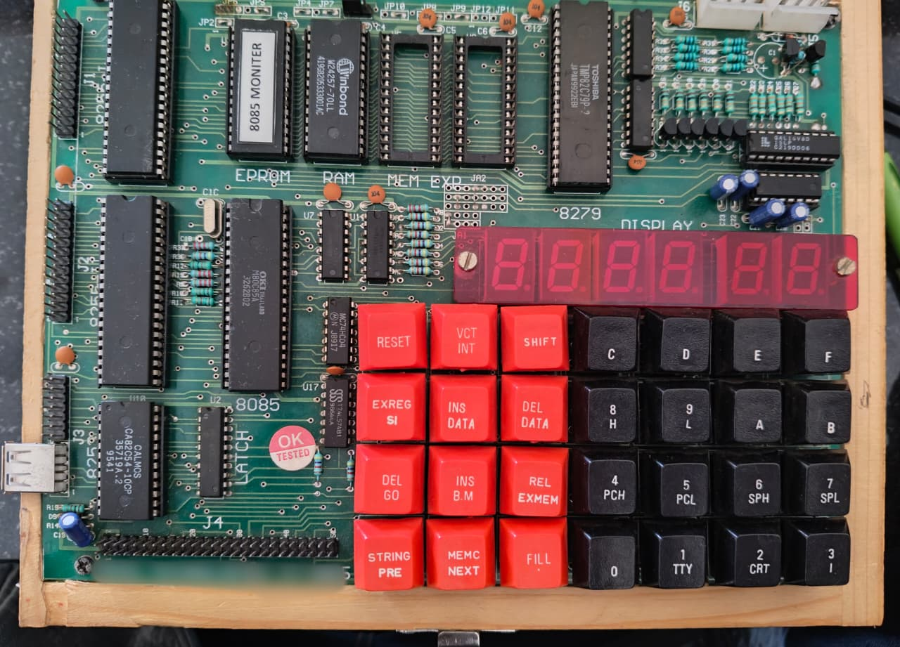

# 🔬 8085 Microprocessor Trainer Kit

> ⚠️ **Disclaimer**  
> This guide is provided strictly for educational purposes.  
> We do not claim ownership of the manufacturing or design of this trainer kit.

---

## 📷 Kit Image

> Ensure the image file `IMG20260218115144.jpeg` is in the same folder as this `README.md`.

---

## 📖 Overview

This repository documents a classic trainer kit based on the **Intel 8085** 8-bit microprocessor.  
It is widely used in academic laboratories to demonstrate:

- Microprocessor architecture
- Assembly language programming
- Memory interfacing
- Peripheral interfacing
- Interrupt handling
- Analog & digital interfacing

The kit provides a complete hands-on environment for learning low-level system design.

---

## ⚙️ Technical Specifications

### 🔹 Processor
- 8085 Microprocessor (8-bit)
- Operating Frequency: **6.144 MHz crystal**

---

### 🔹 Memory Configuration
- 16K / 32K EPROM with monitor program
- 8K / 32K RAM for user applications
- Expandable up to **64K bytes**
- Supports: 2732 / 2764 / 27128 / 27256 / 6264 / 62256
- 4 × 28-pin memory sockets
- User-definable memory mapping
- Battery backup for RAM

---

### 🔹 I/O and Peripheral Interfaces

- **48 Programmable I/O Lines** (via 8255 PPI)
- **Three 16-bit Timers/Counters** (via 8253)
- **Keyboard & Display Controller** (via 8279)
  - 28-Key Hexadecimal Keyboard
  - Six 7-Segment Displays
- RS-232C Serial Interface (75–4800 baud)
- EPROM Programmer (27 Series)
- 50-Pin FRC Connector (STD Bus configuration)

---

### 🔹 Analog & Control Interface

- 8-Channel ADC (ADC0809)
- 1-Channel 8-bit DAC (DAC0800)
- 1 Relay Output (2 NO + 1 NC contacts)
- 1 Opto-Isolated Input

---

## 🧠 Monitor Software Features

The onboard monitor provides powerful system control commands:

- Assembler / Disassembler
- Relocate
- String Operations
- Fill Memory
- Insert / Delete
- Block Move
- Examine & Compare Memory
- Examine Registers
- Insert Data
- Single Step Execution
- Go Command
- Breakpoint Support
- Serial & Keyboard Mode Operation
- PC File Upload/Download Support

---

## 🎯 Educational Applications

This trainer kit is ideal for:

- Microprocessor laboratory courses
- Embedded systems fundamentals
- Assembly language programming practice
- Hardware interfacing experiments
- Academic research & demonstrations

---

## 🏫 Intended Audience

- Electronics & Electrical Engineering Students  
- Embedded Systems Beginners  
- Polytechnic & Engineering Colleges  
- Hobbyists & Hardware Enthusiasts  

---

## 📌 Repository Purpose

This repository serves as:

- 📘 Documentation reference
- 🧾 Academic lab support material
- 🛠️ Technical overview guide
- 💡 Learning resource for 8085 architecture

---

## 📜 License

This documentation is provided for **educational and academic use only**.

---

